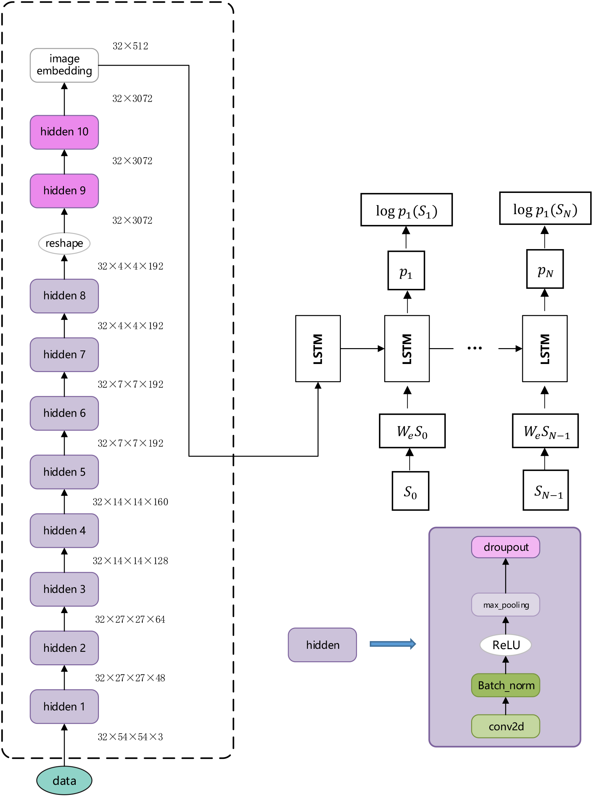
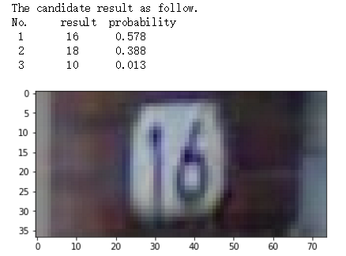
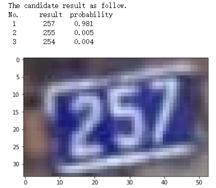

# SVHN_RNN
A TensorFlow implementation of the assignment in [Udacity.com](https://classroom.udacity.com/courses/ud730/lessons/224c71d3-9dc3-4cb5-abca-f8d12fce5cfa/concepts/f4215f02-b293-476c-97fa-c1e6ed83979b), referred to [SVHNClassifier](https://github.com/potterhsu/SVHNClassifier) and [im2txt](https://github.com/tensorflow/models/tree/master/im2txt). The *SVHN_RNN* model combines both CNN and RNN, the CNN layer encodes an image into a fixed-length vector representation, and then the RNN layer decodes the representation into a series of digital numbers(housenumbers).

Dataset available from: [Street View House Numbers (SVHN)](http://ufldl.stanford.edu/housenumbers/)

## Contact
***Author***: lixuan

***E-mail***: lixuan0023@163.com

## Contents
* [Model Overview](#model-overview)
    * [Introduction](#introduction)
    * [Architecture](#architecture)
* [Getting Started](#getting-started)
    * [A Note on Hardware and Training Time](#a-note-on-hardware-and-training-time)
    * [Install Required Packages](#install-required-packages)
    * [Prepare the Training Data](#prepare-the-training-data)
* [Training a Model](#training-a-model)
* [Generating Captions](#generating-captions)

## Model Overview

### Introduction

The *SVHN_RNN* model is a deep neural network that learns how to show
the housenumbers.

### Architecture

The *SVHN_RNN* model is an example of an *encoder-decoder* neural network.
It works by first "encoding" an image into a fixed-length vector representation, and then "decoding" the representation into a natural language description.

The image encoder is a deep convolutional neural network. This type of network is widely used for image tasks and is referred to the convolutional layer in [SVHNClassifier](https://github.com/potterhsu/SVHNClassifier).

The decoder is a long short-term memory (LSTM) network. This type of network is
commonly used for sequence modeling tasks such as language modeling and machine
translation. In the *SVHN_RNN* model, the LSTM network is trained as a simple language model conditioned on the image encoding.

Digits in the housenumbers are represented with an embedding model. Each digit in the vocabulary is associated with a fixed-length vector representation that is
learned during training.

The following diagram illustrates the model architecture.



In this diagram, \{*s*<sub>0</sub>, *s*<sub>1</sub>, ..., *s*<sub>*N*-1</sub>\}
are the digits of the numbers and \{*w*<sub>*e*</sub>*s*<sub>0</sub>,
*w*<sub>*e*</sub>*s*<sub>1</sub>, ..., *w*<sub>*e*</sub>*s*<sub>*N*-1</sub>\}
are their corresponding digit embedding vectors. The outputs \{*p*<sub>1</sub>,
*p*<sub>2</sub>, ..., *p*<sub>*N*</sub>\} of the LSTM are probability
distributions generated by the model for the next digit in the housenumbers. The terms \{log *p*<sub>1</sub>(*s*<sub>1</sub>), log *p*<sub>2</sub>(*s*<sub>2</sub>), ..., log *p*<sub>*N*</sub>(*s*<sub>*N*</sub>)\} are the log-likelihoods of the correct digit at each step; the negated sum of these terms is the minimization objective of the model.

The convolutional hidden layer includes kinds of unit, including the `tf.layers.conv2d`, `tf.layers.batch_normalization`, `tf.nn.relu`, `tf.layers.max_pooling2d` and `tf.layers.dropout` as shown in the above figure.


## Getting Started

### A Note on Hardware and Training Time

The time required to train the *SVHN_RNN* model depends on your specific
hardware and computational capacity. In my experience on 8 *NVIDIA Tesla K20c* GPUs, the whole training phase may take 4-5 days to achieve peak performance (but you can stop this phase early and still get reasonable results).

It is not recommended running this code on a CPU, because this may be dozens times slower.

### Install Required Packages
First ensure that you have installed the following required packages:

* **TensorFlow** 1.0 or greater ([instructions](https://www.tensorflow.org/install/))
* **NumPy** ([instructions](http://www.scipy.org/install.html))
* **h5py** ([instructions](http://docs.h5py.org/en/latest/build.html))
* **pillow** ([instructions](https://pillow.readthedocs.io/en/latest/installation.html))
```
In Ubuntu:
$ sudo apt-get install libhdf5-dev
$ sudo pip install h5py

Install pillow:
$ sudo pip install Pillow
```

### Prepare the Training Data

To train the model you will need to provide training data in native TFRecord format. The TFRecord format consists of a set of sharded files containing serialized `tf.SequenceExample` protocol buffers. Each `tf.SequenceExample` proto contains an image (PNG format), a housenumber and so on.

Each housenumber is a list of digits. During preprocessing, a dictionary is created that assigns each digit in the vocabulary to an integer-valued id. Each housenumber is encoded as a list of integer digit ids in the `tf.SequenceExample` protos.

Note that: the digits of 0,1,...,9 are represented by the labels '0','1',...,'9' respectively; then the label '10' is the starting flag, and the label '11' is the endding flag. The format of housenumber list is `10,XXX,11`.

We have provide a script to preprocess the image and digits. Before preprocessing, downloading the dateset from [Street View House Numbers (SVHN)](http://ufldl.stanford.edu/housenumbers/), and extracting them to the project dir.

The folder structure should be like below:
```
SVHN_RNN
    - data
        - extra
            - 1.png 
            - 2.png
            - ...
            - digitStruct.mat
        - test
            - 1.png 
            - 2.png
            - ...
            - digitStruct.mat
        - train
            - 1.png 
            - 2.png
            - ...
            - digitStruct.mat
```

## Training a Model

### 1. Convert to TFRecords format
```
$ python convert_to_tfrecords.py --data_dir ./data
```
### 2. Train
```
$ python train.py --data_dir ./data --train_logdir ./logs/train
```
### 3. Retrain if you need
```
$ python train.py --data_dir ./data --train_logdir ./logs/train2 --restore_checkpoint ./logs/train/latest.ckpt
```
### 4. Evaluate
```
$ python eval.py --data_dir ./data --checkpoint_dir ./logs/train --eval_logdir ./logs/eval
```
### 5.Visualize
```
$ tensorboard --logdir ./logs
```

## Generating Captions
### Run in Jupyter
```
Open 'run_inference.ipynb' in Jupyter
```
### Result


